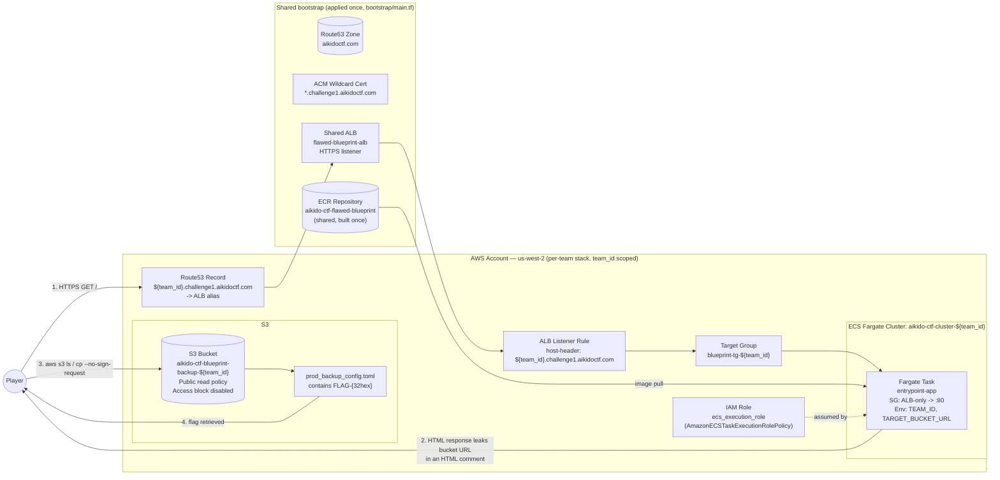

# Architecture Diagram — Challenge 1: The Flawed Blueprint

## Notes

- Every per-team resource (bucket, cluster, IAM role, task family, security group, target group,
  listener rule, DNS record) is name-suffixed with `team_id`, so each team's
  `terraform apply -var="team_id=<team>" -var="zone_name=aikidoctf.com" -var="ctf_domain=challenge1.aikidoctf.com"`
  provisions a fully isolated set of resources. Teams share only read-only lookups: the ECR image,
  the Route53 zone, and the ALB/listener (distinguished per team by host-header rule, not by
  separate load balancers) — the same shared-resource pattern Challenge 2 uses.
- The container image itself is generic: it is built and pushed to ECR **once** (see
  `app/README.md`) and reused by every team's task via environment-variable injection, not
  per-team image builds.
- The bucket's public read policy plus disabled public-access-block settings are the sole
  vulnerability — everything else in the stack (execution role, security group, ALB routing, ECS
  service) exists only to host the entry-point web app that leaks the bucket's URL.
