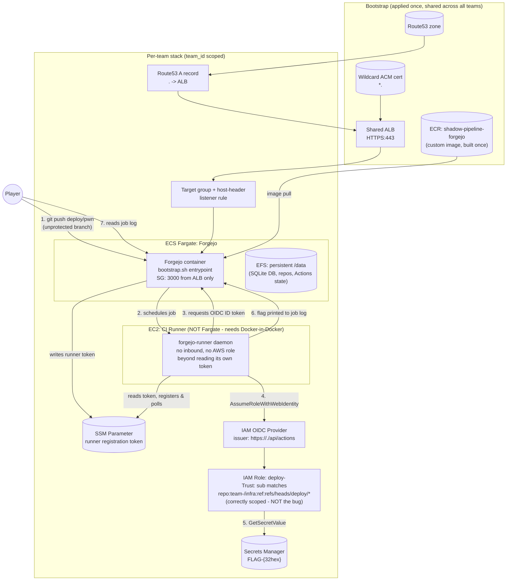

# Architecture Diagram — Challenge 2: The Shadow Pipeline Overlord

## Notes

- Every per-team resource (Forgejo task, EFS volume, EC2 runner, IAM OIDC provider, IAM role,
  Secrets Manager secret, Route53 record) is name-suffixed with `team_id`, matching Challenge 1's
  isolation convention. The only things shared across teams are the bootstrap resources (ALB, ACM
  cert, Route53 zone, ECR image) — all read-only from each team's perspective.
- The **only** thing that differs from a textbook-correct OIDC CI/CD setup is Forgejo's branch
  protection configuration (protects `main`, omits `deploy/*`). The AWS IAM side — the OIDC
  provider, the trust policy's ref condition, the role's attached permissions — is intentionally
  configured the way a careful team actually would.
- The CI runner runs on EC2, not Fargate, because it needs to launch Docker containers per job
  (the Docker executor `act_runner`/`forgejo-runner` requires) — Fargate does not support
  privileged containers or Docker-in-Docker.
