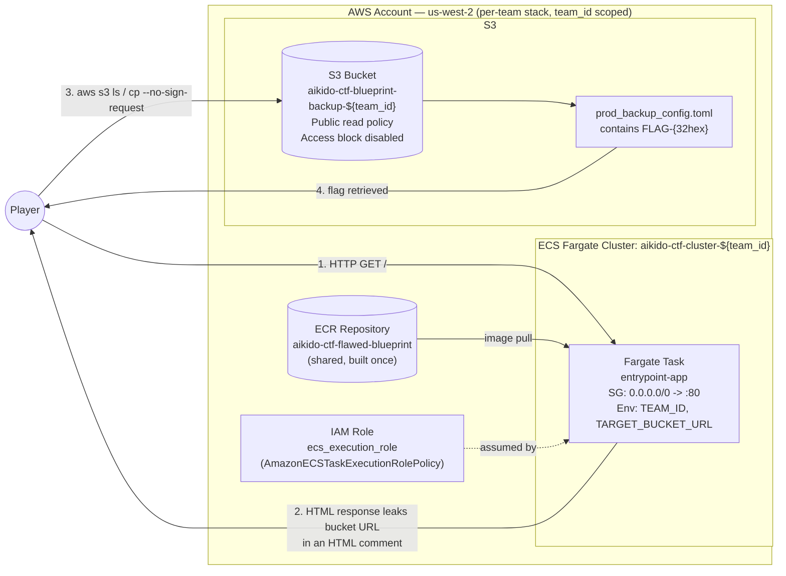

# Architecture Diagram — Challenge 1: The Flawed Blueprint

## Notes

- Every resource (bucket, cluster, IAM role, task family, security group, service) is name-suffixed
  with `team_id`, so each team's `terraform apply -var="team_id=<team>"` provisions a fully
  isolated set of resources — no shared state between teams except the read-only ECR image.
- The container image itself is generic: it is built and pushed to ECR **once** (see
  `app/README.md`) and reused by every team's task via environment-variable injection, not
  per-team image builds.
- The bucket's public read policy plus disabled public-access-block settings are the sole
  vulnerability — everything else in the stack (execution role, security group, ECS service) exists
  only to host the entry-point web app that leaks the bucket's URL.
